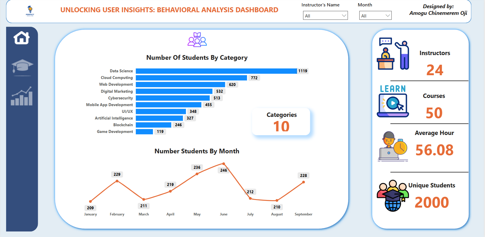

## ABOUT ME
Hello! I am Chinemerem Oji Amogu 👴, a data analyst and consultant with a passion for turning data into actionable insights. With experience across sales, operations, finance and customer service, I help businesses solve challenges and unlock growth with data-driven decisions.

## WHAT I DO

*As the Data Analyst, I provide consulting services for businesses and mentor aspiring analysts.*

**- ✅ Data Analytics Consulting.** 

**- ✅ Data Cleaning and Transformation.**

## MY PROJECTS 

*A window into some of the projects I've worked on.*

**PERFECT EDUCATION’S BEHAVIOURAL DASHBOARD ANALYSIS.**

A deep dive into the market-fit of this educational platform.

[Read More](https://medium.com/@AmoguChinemeremOji/perfect-educations-behavioural-dashboard-analysis-47f5203fa5d6)

## CONTACT DETAILS

*Let’s connect and see what we can create together!*
<table>
  <tbody>
    <tr>
      <td>📧</td>
      <td><a href="mailto:amoguchinemerem32@gmail.com">amoguchinemerem32@gmail.com</a></td>
    </tr>
    <tr>
      <td>📞</td>
      <td>(+234) 818-287-3871</td>
    </tr>
    <tr>
      <td>📍</td>
      <td>Lagos, Nigeria</td>
    </tr>
    <tr>
      <td>⬇️</td>
      <td><a href="Chinemerem's Professional CV Resume.pdf">Download my CV</a></td>
    </tr>
    <tr>
      <td>🌐</td>
      <td><a href="www.linkedin.com/in/chinemerem-amogu/">The things I do daily on LinkedIn</a></td>
    </tr>
    <tr>
    </tr>
  </tbody>
</table>
